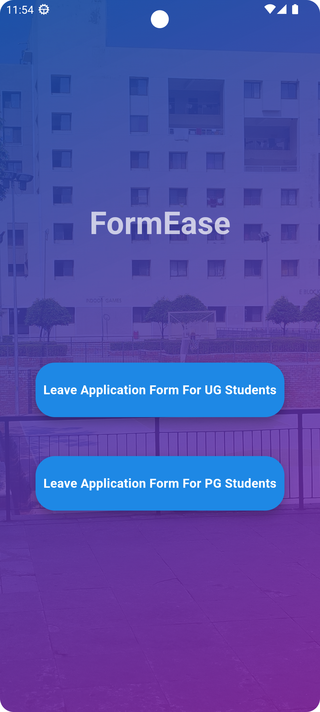
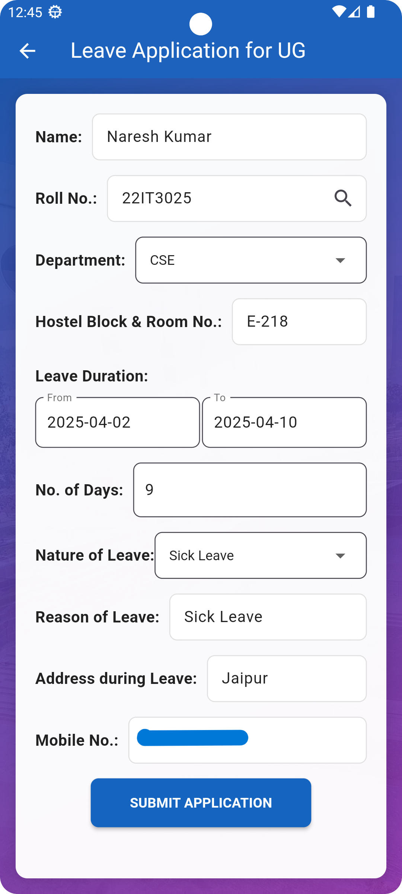
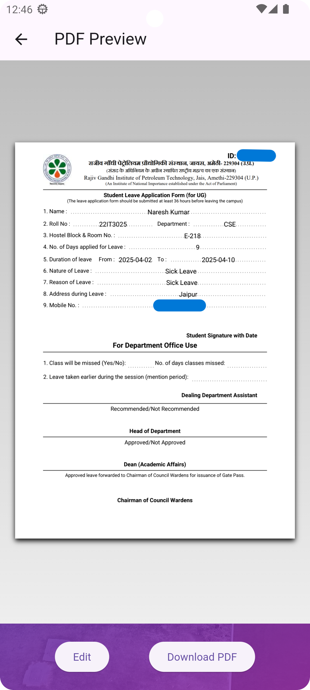
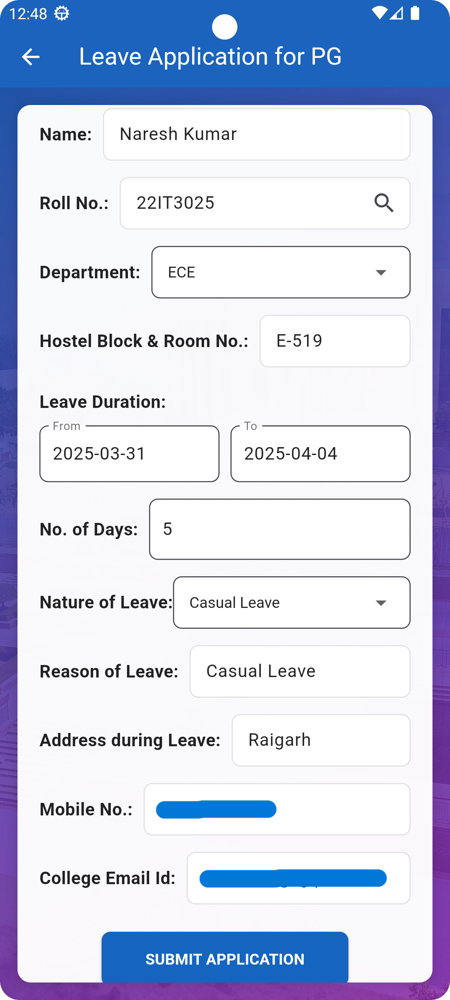
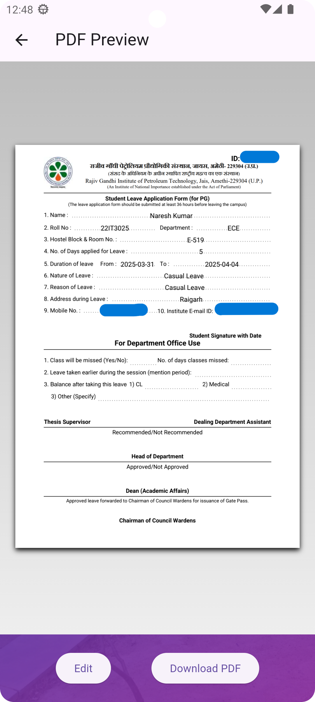

#  **FormEase User App**

## Overview
The **FormEase User App** is a Flutter-based mobile application that allows students to submit leave applications seamlessly. The app generates a PDF with a unique 6-character ID for each leave application and stores all form details in a MySQL database for record-keeping.

---

## 🌟 Features

- Submit leave application forms with the following details:  
    - Name  
    - Roll Number  
    - Department  
    - Hostel Block & Room No.  
    - Leave Duration (From and To dates)  
    - Number of Days  
    - Nature of Leave  
    - Reason for Leave  
    - Address During Leave  
    - Mobile Number  

- Automatically generates a **PDF of the Leave Application** with a unique **6-character ID**.  
- Users can **download the PDF** of their application.  
- All form data is saved in the **MySQL database** for record-keeping.  
- **Real-time validation** ensures valid roll numbers.  

---

## 🔧 Tech Stack

- **Frontend:** Flutter (Dart)  
- **Backend:** Python  
- **Database:** MySQL  
- **PDF Generation:** `flutter_pdf` package  

---

## 📱 Installation and Setup

### 💻 Prerequisites
- Flutter installed  
- MySQL server running  
- Python installed  

### 🔥 Steps
1. **Clone the Repository**
```sh
git clone https://github.com/naresh6184/FormEase_User_App.git
cd FormEase_User_App
```
2. **Install dependencies**
```sh
flutter pub get
```

4. **Run the app**
```sh
flutter run
```


## 🛠️ Database Configuration

Ensure you have a MySQL server running.  
Create the required tables with the following schemas:

```sql
CREATE DATABASE leave_management;  
USE leave_management;  

CREATE TABLE leave_applications (
    application_id VARCHAR(6) PRIMARY KEY,
    approved INT(2) default 0  ,
    name VARCHAR(255) NOT NULL,
    roll_no VARCHAR(20) NOT NULL,
    department VARCHAR(100) NOT NULL,
    hostel_block VARCHAR(50) NOT NULL,
    days INT NOT NULL,
    leave_start_date DATE NOT NULL,
    leave_end_date DATE NOT NULL,
    nature_of_leave VARCHAR(50) NOT NULL,
    reason TEXT NOT NULL,
    address TEXT NOT NULL,
    mobile VARCHAR(15) NOT NULL,
    institute_email VARCHAR(255) default "N/A",
    created_at TIMESTAMP DEFAULT CURRENT_TIMESTAMP
);
```
```sql
CREATE TABLE students (
    roll_no VARCHAR(20) PRIMARY KEY,
    name VARCHAR(255) NOT NULL
);
```

## ⚙️ API Endpoints
--------------------

### 🔥 Backend Server (Python)

The app uses RESTful APIs to fetch and store leave application data.

### Fetch Student Name by Roll Number
```sh
GET http://<your-server-ip>:5000/get-student-name?roll_no=<roll_number>
```

### 📤 Submit Leave Application
```sh
POST http://<your-server-ip>:5000/submit-leave
```
### Request Body 
```json
{
    "name": "Amit Kumar",
    "roll_number": "22IT3025",
    "department": "IT",
    "hostel_block_room": "B-101",
    "leave_from": "2025-04-01",
    "leave_to": "2025-04-05",
    "no_of_days": 5,
    "nature_of_leave": "Personal",
    "reason": "Family function",
    "address": "Patna, Bihar",
    "mobile_number": "9876543210"
}

```

## App Screenshots

| Home Page |
|-----------|
|  |

| UG Leave Form | UG Leave PDF |
|-------------------|------------------|
|  | |

| PG Leave Form | PG Leave PDF |
|-------------------|------------------|
|  | |


## Contributing
1. Fork the repository.  
2. Create a feature branch:  
   ```sh
   git checkout -b feature/new-feature
    ```
3. Commit your changes:  
   ```sh
   git commit -m "Add new feature"
    ```
4. Push to branch:  
   ```sh
   git push origin feature/new-feature
    ```
5. Create a pull request.

## License
This project is licensed under the **MIT License**.

---

## Author
Naresh Jangir

Contact: nareshjangir6184@gmail.com

---